# Lesson 1
 
This lesson will be start to C++.

## Glossary

- Unix users: users that have MacOS or Linux;
- Windows users: like previous user but with Windows.

## Preparation

At the very beginning of each step in the list below you might find set of symbols
- : means that this is necessary for users of Windows
- : means that this is necessary for users of Linux
- : means that this is necessary for users of MacOS

Step must be done at all systems, if no symbol at the very beginning.

1.  Install [Visual Studio Code (VS Code)](https://code.visualstudio.com/download) and open it
2.  Open extensions. You can find ,,bricks`` in the left panel. Also, you may call it via `ctrl+shift+X`.
3.  Install C++ extensions for VS Code.
  - [C/C++](https://marketplace.visualstudio.com/items?itemName=ms-vscode.cpptools).
  - [C/C++ Extension Pack](https://marketplace.visualstudio.com/items?itemName=ms-vscode.cpptools-extension-pack).
4. Install additional packages
  -  [MSYS2](https://www.msys2.org/).
  -  [xcode-command-line tools](https://developer.apple.com/documentation/xcode/installing-the-command-line-tools).
  -  [gcc](gcc.gnu.org): `sudo apt install gcc`.
5.  Open MSYS2 and install necessary packages for C++.
  - `pacman -S gcc`.
6.  Update **System** environment variables.
  - Open **System** environment variables.

    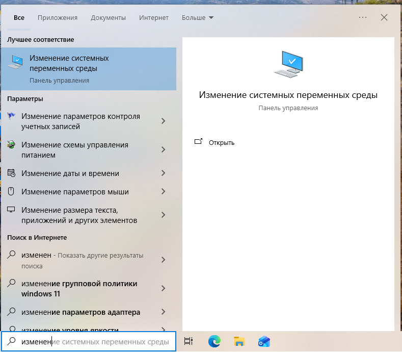

  - Push the button **environment variables** on the left lower corner of the window.

    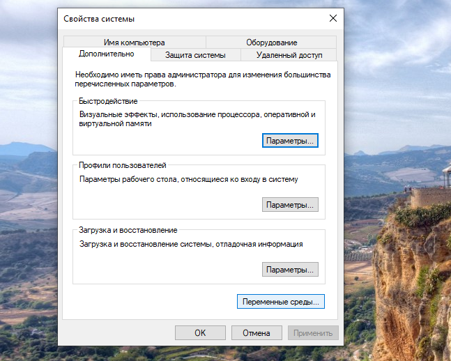

  - Choose `PATH` variable.
  - Press `Modify` button on the right side of window.

    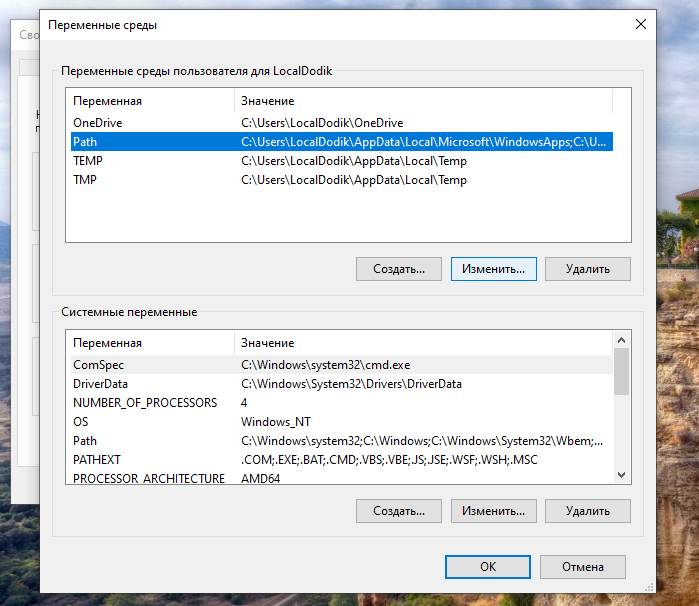

  - Press `Add` button.
  - Insert path to MSYS2 directory with suffix `\usr\bin`. It might be something like `C:\msys2\usr\bin`.

    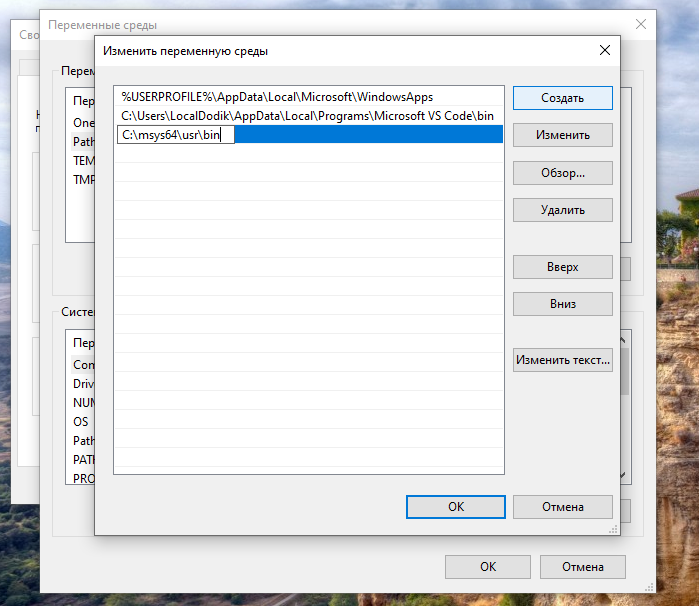

  - Save changes and close all windows.
7.  Restart VS Code.
8.  Open terminal: `ctrl+` `.
9.  Call `gcc`, it might give next output:
```bash
gcc: fatal error: no input files
compilation terminated.
```
10.  Repeat same for `g++`.
11.  Close terminal via `ctrl+` ` or just press cross in the right upper corner of the terminal window.
12.  Open folder. It could be done via upper left menu: `File->Open Folder` or via combination `ctrl+K ctrl+O`.

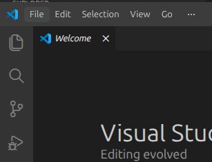
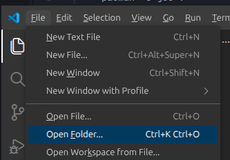

13. Choose place for all you programs of this semester
  - Do **not** use remote drives, especially `OneDrive` directory

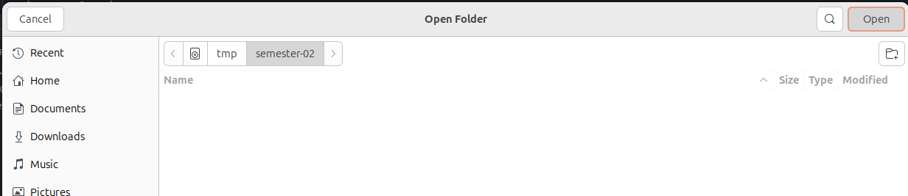

14. Create directory for the first lesson. Something like `sem01` or `lesson01`.
  - Do **not** use space ` ` in names of directories and files.
  - Do **not** use special symbols `/|\@!?*&^%#()[]{}:;'"` in names of directories and files.
  - Minus `-` and underscore `_` are fine in names.

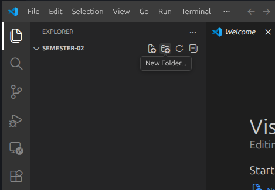
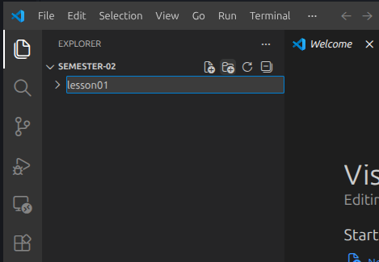

15. Create file for the first program inside directory of the first lesson. Example, `task0.cpp`.

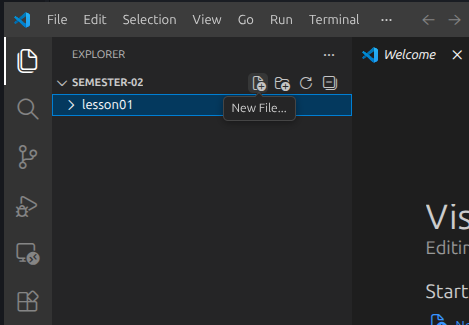
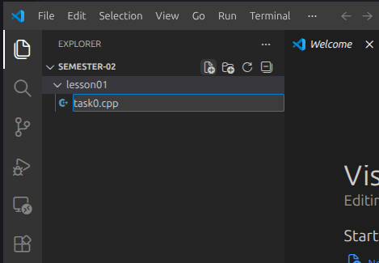

## My first program

```cpp
#include <iostream>             // "import" of library

int main() {                    // all cpp programs have main function, it is our entry point
  std::cout << "Hello, world!"  // Special function to put (<<) something in console
    << std::endl;               // Special function to set new line
  return 0;                     // return 0 to say "everything is fine"
}
```

## How to compile and run

First step is compilation. Compilation has several stages but for us now it is just run of the following command
```bash
g++ lesson01/task0.cpp
```
**Pay attention**: path to your file might differs with the path above.

After the compilation you will create executable file.
For windows user
```bash
.\a.exe
```
or (for unix users)
```bash
./a.out
```
