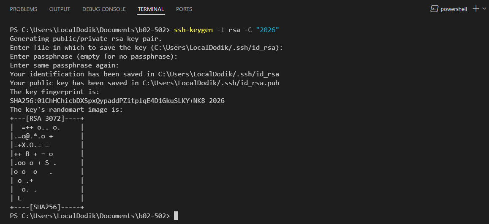
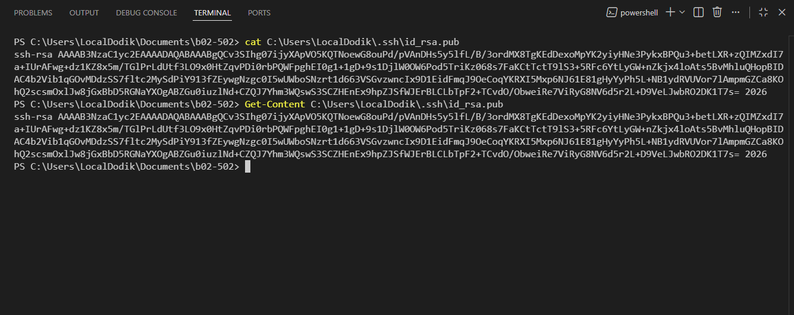

# Lesson 4

## How to work with git

### Installation

At the very beginning of each step in the list below you might find set of symbols
- : means that this is necessary for users of Windows
- : means that this is necessary for users of Linux
- : means that this is necessary for users of MacOS

-  open MSYS2 and run
```
pacman -S git
```
-  (alternative): if you do not use MSYS2, try to install git via [git-bash](https://github.com/git-for-windows/git/releases/tag/v2.53.0.windows.1)
- : you should install [command-line tools](https://developer.apple.com/documentation/xcode/installing-the-command-line-tools?changes=latest_minor)
- : based on your distribution
```bash
sudo apt install git
# or
sudo dnf install git
# or
pacman -S git
# etc...
```
- Make sure that git is installed. Call it in command line
```bash
git
```

### My first repository

Choose any provide of distributed repositories:
- [GitHub](https://github.com/)
- [GitLab](https://gitlab.com/)
- [GitFlic](https://gitflic.ru/)
- [GitVerse](https://gitverse.ru/)
- Something else...

Repository must be **public**. Create empty repository, do not add `README.md` and `.gitignore`.

### Initialization of repository locally

1. Open your folder with code via VS Code
2. Open terminal
3. Run next command
```bash
git init
```
4. Add remote to your repository
```bash
git remote add origin [ssh-link-to-remote-repo]
```
where `[ssh-link-to-remote-repo]` must by replaced with `ssh`-link from repository. `ssh`-link could be find under the `Code` button. `ssh`link usually looks like `git@...`
5. Do the common preparation for git. Configure your name and email for the local repository:
```bash
git config user.name "Name Surname"
git config user.email "my@mail.com"
```

### ssh key

You must have access to remote repository to push something in it. Access must be provided after authentitication. It could be done in two ways:
- Each time print your `login` and `password`
- Use pair of private, public ssh key

Let's discuss how to create pair of ssh keys.
1. Open terminal
2. Run command. Press enter every time
```bash
ssh-keygen -t rsa -C "2026"
```
  Output of the command will look like

  

3. Try to show content of the genrated public key (name of it ends with `.pub`)

  

  Screenshot above demonstrates two variant of showing: via linux command `cat` or via windows command `Get-Content`

4. Add text of public part to your account on remote git storage:
  - [GitHub](https://docs.github.com/en/authentication/connecting-to-github-with-ssh/adding-a-new-ssh-key-to-your-github-account?platform=windows#adding-a-new-ssh-key-to-your-account)
  - [GitLab](https://docs.gitlab.com/user/ssh/#add-an-ssh-key-to-your-gitlab-account)
  - [GitFlic](https://docs.gitflic.ru/latest/profile/ssh/)
  - [GitVerse](https://gitverse.ru/docs/collaborative/authentification/ssh-keys/)


### First file, first commit, first push

1. Create a file and put some code in it, or something else
2. Run the following command
```bash
git add [filename]
```
  where `[filename]` is name, or names, of file that we want to add to commit
3. Create your first commit
```bash
git commit -m "[commit message]"
```
  where `[commit message]` is description of your first commit
4. Check that commit was created. The command below must show commit message, author, timestamp of your first commit
```bash
git log
```
5. Push your commit to the remote repository
```
git push origin HEAD
```
6. Check remote repository in browser, make sure that file was uploaded